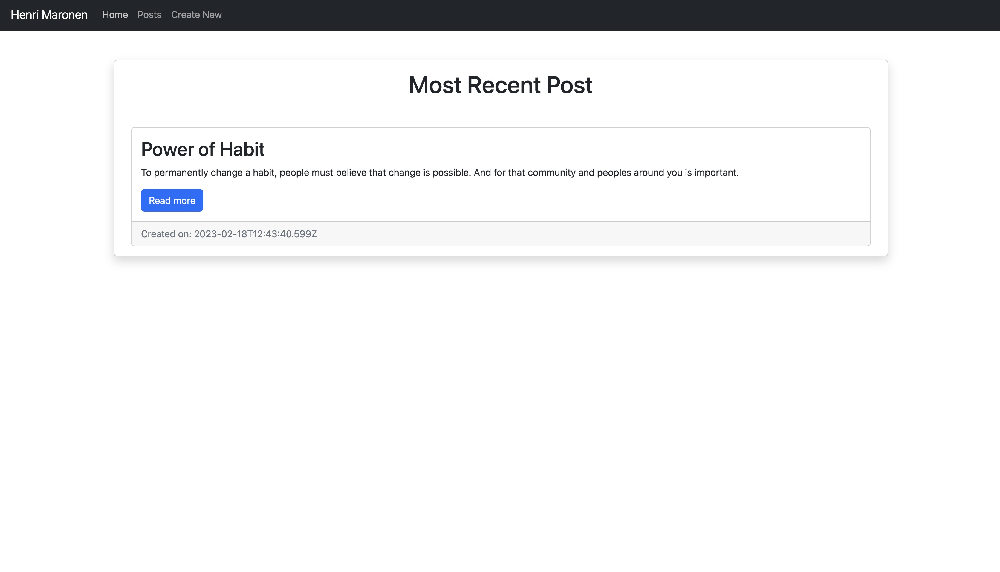
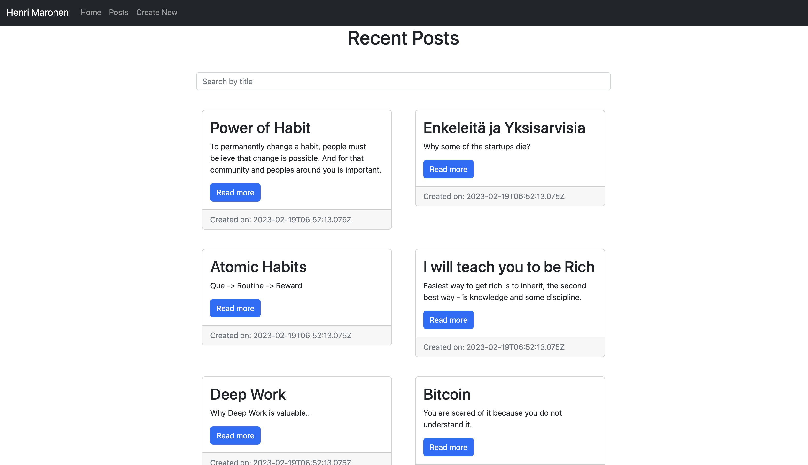
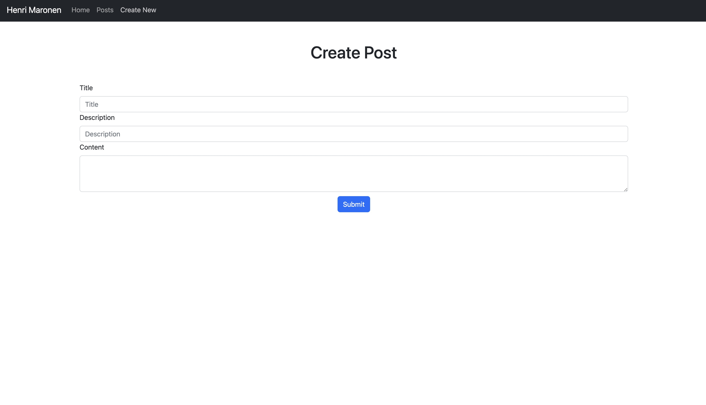
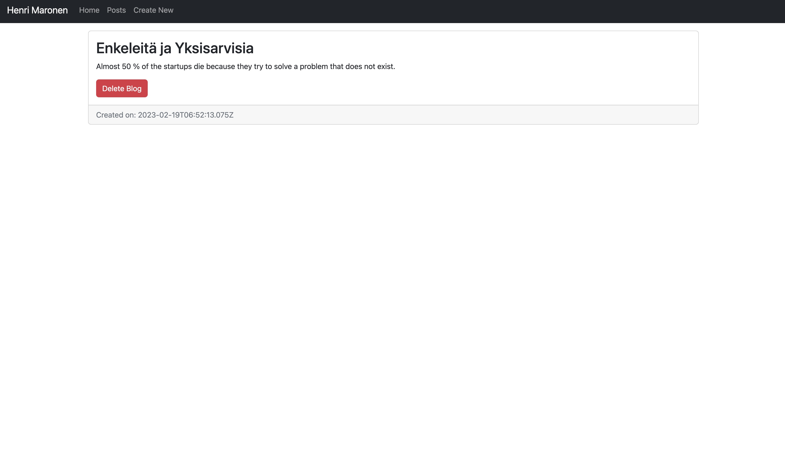

# Slush Pre-Assignment - Blog

## How to use

### Server / Backend

1. `npm run dev` - Start backend API
2. `npm run seed` - Seeds the database with example blogs

### Client / Frontend

1. `npm run start` - Start frontend

## Server Endpoints

### blogs

`GET /blogs`

`GET /blogs/newest`

`GET /blogs/:id`

`POST /blogs`

`DELETE /blogs`

## Preview

### Landing page

### Gallery

### Create New

### Create New

